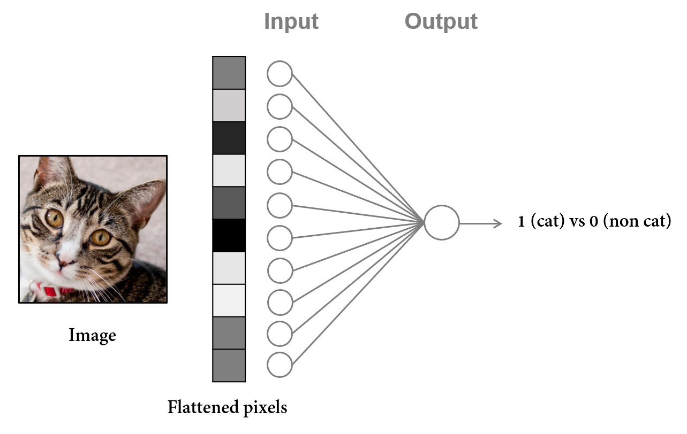
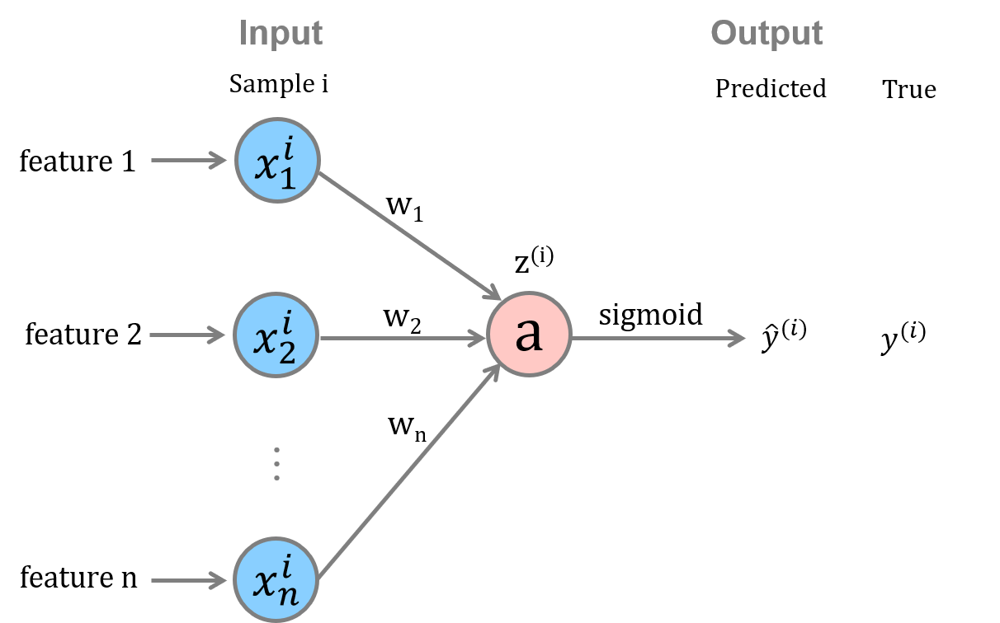
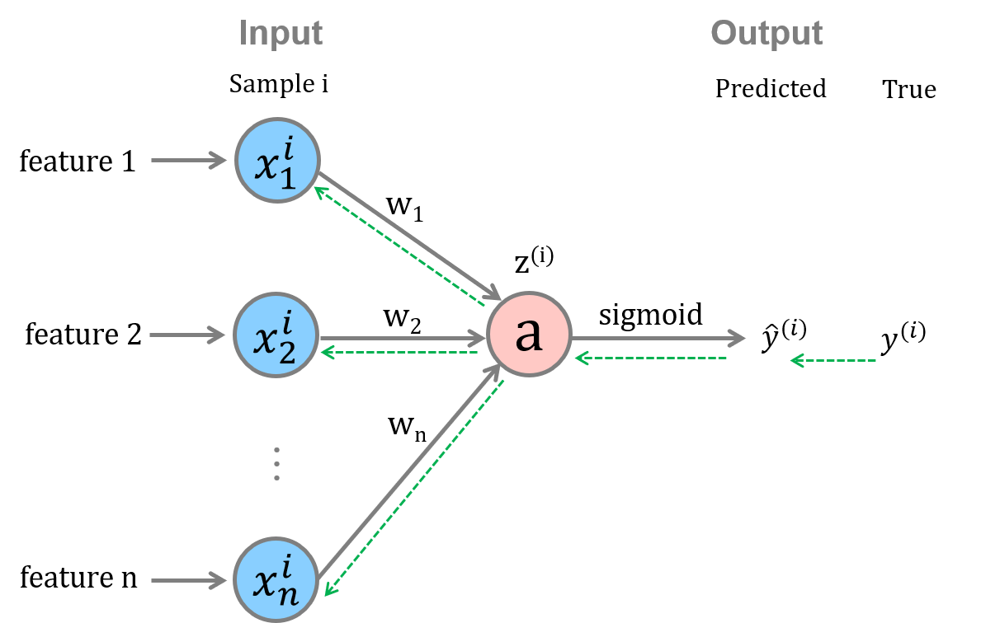

# Neural Network Step by Step - Part I

### Logistic regression from scratch

In part I, we will work on the simplest neural network, which includes an **_input layer_** with **_n_** nodes (each representing a **_feature_** of the input) and **_one_** node in the **_output layer_**. This type of neural network can be used to identify whether the item belongs to a certain category (Yes = 1; No = 0). 

> For example, given a series of features ($ x_1, x_2, \dots x_n $) of a picture, the model can judge whether it is a cat (Yes = 1; No = 0). 
>
> 


We will train this neural network using **_m_** samples. Before showing codes, let's go through the calculation of **_feed-forward_** and **_backward propagation_** process.



#### Feed-forward

* **For sample i **

  Let's first define the vector representation of sample i and weight.
  $$
  \begin{gather*}
  
  x^{(i)} = 
          \begin{pmatrix}
              x^i_1\\
              x^i_2\\
              \vdots\\
              x^i_n\\
          \end{pmatrix}_{\textcolor{red}{n \times 1}} 
  
  \qquad
  
  w = 
          \begin{pmatrix}
              w_1\\
              w_2\\
              \vdots\\
              w_n\\
          \end{pmatrix}_{\textcolor{red}{n \times 1}}
  
  \end{gather*}
  $$
  We can then calculate z for sample i and represent it in a more concise way.

$$
\begin{align*}
z^{(i)} &= x^i_1w_1 + x^i_1w_1 + \dots + x^i_nw_n + b_i \\
        &= (w_1,w_2,\dots,w_n)
        \begin{pmatrix}
            x^i_1\\
            x^i_2\\
            \vdots\\
            x^i_n\\
        \end{pmatrix} + b_i\\
        &= w^Tx^{(i)} + b_i
\end{align*}
$$

* **For all samples**

$$
\begin{align*}

Z       &= (z^{(1)},z^{(2)},\dots,z^{(m)})_{\textcolor{red}{1 \times m}}\\
        &= [w^Tx^{(1)}+b_1,w^Tx^{(2)}+b_2,\dots,w^Tx^{(m)}+b_m]\\
        &= w^T[x^{(1)},x^{(2)},\dots,x^{(m)}]+[b_1,b_2,\dots,b_m]\\
        &= w^TX + b \\[10pt]

w^T     &= [w_1,w_2,\dots,w_n]_{\textcolor{red}{1 \times n}}

\qquad

X        = 
         \begin{pmatrix}
             x^1_1 & x^2_1 & \dots & x^m_1\\
             x^1_2 & x^2_2 & \dots & x^m_2\\
             \vdots& \vdots& \vdots& \vdots\\
             x^1_n & x^2_n & \dots & x^m_n\\
         \end{pmatrix}_{\textcolor{red}{n \times m}}\\[10pt]

\hat{Y} &= sigmoid(Z) =
[\hat{y}^{(1)},\hat{y}^{(2)},\dots,\hat{y}^{(m)}]_{\textcolor{red}{1 \times m}}

\end{align*}
$$

#### Back propagation

Back propagation starts by comparing the **_predicted value $ \hat{y} $_** to the **_true value $ y $_**, which produces the **loss**. It then updates the weights $ w $ and bias $ b $ using **_gradient descent_**. Through iterations, the weights and bias are optimized.    



* **Loss function $L(a,y)$**

  Here, we use the **_cross entropy_** loss function. There are other options such as **_mean squared error_**.
  $$
  L(a,y) = -ylog\,a-(1-y)log(1-a)
  $$

* **Cost function $J(a,y)$**

  As defined, cost function is the **_mean_** of the loss of all samples.

$$
J(a,y) = J(w,b)=\frac{1}{m} \sum_{i=1}^{m}L(a,y)
$$

* **Gradient descent**

  *Based on chain rules,*
  $$
  \begin{align*}
  
        \frac{\partial L(a,y)}{\partial w} 
     &= \frac{\partial L(a,y)}{\partial a} \cdot
        \frac{\partial a}     {\partial z} \cdot
        \frac{\partial z}     {\partial w}
  
  \\[10pt]
  
        \frac{\partial L(a,y)}{\partial b} 
     &= \frac{\partial L(a,y)}{\partial a} \cdot
        \frac{\partial a}     {\partial z} \cdot
        \frac{\partial z}     {\partial b}
  
  \end{align*}
  $$
  **Note:** the *sigmoid* function is
  $$
  a = \sigma(z) = \frac{1}{1+e^{-z}}
  $$
  
  $$
  \begin{align*}
  
        \frac{\partial L(a,y)}{\partial a} 
      &= -y \, \frac{1}{a} - (1-y) \, \frac{1}{1-a}(-1)\\
      &= -\frac{y}{a} + \frac{1-y}{1-a}
  
  \\[15pt]
  
        \frac{\partial a}{\partial z} 
      &= \frac{0-1 \cdot e^{-z} \cdot (-1)}{(1 + e^{-z})^2}\\
      &= \frac{e^{-z}}{(1 + e^{-z})^2}\\
      &= \frac{1}{1 + e^{-z}} \cdot \frac{e^{-z}}{1 + e^{-z}}\\
      &= \frac{1}{1 + e^{-z}} \cdot (1-\frac{1}{1 + e^{-z}})\\
      &= a \cdot (1-a)
  
  \end{align*}
  $$
  Therefore,
  $$
  \begin{align*}
    
     \frac{\partial L(a,y)}{\partial a} \cdot
     \frac{\partial a}     {\partial z}
     &= (-\frac{y}{a} + \frac{1-y}{1-a}) \, a(1-a)\\
     &= -y(1-a)+a(1-y)\\
     &= a-y
  
  \end{align*}
  $$
  

  Moving on, for the partial derivatives of $ z = w^T + b $  to $ w $ and $ b $,

  * In the case of **sample i**, because
    $$
    \begin{align*}
    
          \frac{\partial z}{\partial w} = x_{\textcolor{red}{n \times 1}}
          
          \qquad
          
          \frac{\partial x}{\partial b} = 1_{\textcolor{red}{1 \times 1}}
    
    
    
    
    \end{align*}
    $$
    we can get
    $$
    \begin{align*}
    
           \frac{\partial L(a,y)}{\partial w} 
        &= x_{\textcolor{red}{n \times 1}} (a-y)_{\textcolor{red}{1 \times 1}}
    
    \\[15pt]
    
           \frac{\partial L(a,y)}{\partial b} 
        &= (a-y)_{\textcolor{red}{1 \times 1}} \cdot 1_{\textcolor{red}{1 \times 1}}
    
    
    \end{align*}
    $$

  * In the case of **m samples**,
    $$
    \begin{align*}
    
           \frac{\partial L(A,Y)}{\partial w_{\textcolor{red}{n \times 1}}} 
        &= X_{\textcolor{red}{n \times m}} (A-Y)^T \, _{\textcolor{red}{m \times 1}}
    
    \\[15pt]
    
           \frac{\partial L(A,Y)}{\partial b_{\textcolor{red}{1 \times 1}}}
        &= A-Y \, _{\textcolor{red}{1 \times m}}\\
        &= np.sum(A-Y) \, _{\textcolor{red}{1 \times 1}}
    
    
    \end{align*}
    $$

* **Updating weights and bias**

  The weight $ w $ and bias $ b $ are updated by subtracting the **_mean of cost_** multiplied by the **_learning rate $ \alpha $_**.
  $$
  \begin{alignat}{0}
  
         w \, \gets \, w - \alpha \cdot \frac{1}{m} \cdot X(A-Y)^T  
  
  \\[10pt]
  
         b \, \gets \, b - \alpha \cdot \frac{1}{m} \cdot np.sum(A-Y)
  
  
  \end{alignat}
  $$

* **Revisiting the cost function J**

  Usually, we print/plot the change of cost as a function of iterations. 
  $$
  \begin{align*}
       
       J &= \frac{1}{m} \sum_{i=1}^{m} [-ylog\,a-(1-y)log(1-a)]\\
         &= -\frac{1}{m} \sum_{i=1}^{m} [ylog\,a+(1-y)log(1-a)]\\
         &= -\frac{1}{m} [Ylog\,A+(1-Y)log(1-A)]\\
         &= -\frac{1}{m} np.sum[Ylog\,A+(1-Y)log(1-A)]
  
  \end{align*}
  $$
  **Note:** the $ Ylog\,A+(1-Y)log(1-A) $ is calculated using dot product. 
  
  

### Coding a logistic regression

#### Code: sigmoid function

$$
a = \frac{1}{1+e^{-z}}
$$

```python
# define sigmoid function
def sigmoid(z):
    a = 1 / (1 + np.exp(-z))
    return a
```

#### Code: feed-forward, cost function and gradient descent

* **Feed-forward**

$$
\begin{align*}

Z &= w^TX + b \\[10pt]
A &= \sigma(Z)\\[10pt]

\end{align*}
$$

* **Cost function**
  $$
  J = -\frac{1}{m} np.sum[Ylog\,A+(1-Y)log(1-A)]
  $$

* **Gradient descent**
  $$
  \begin{align*}
  
         \frac{\partial L(A,Y)}{\partial w} &= X (A-Y)^T
  
  \\[12pt]
  
         \frac{\partial L(A,Y)}{\partial b} &= np.sum(A-Y)
  
  
  \end{align*}
  $$
  

```Python
# initialize parameters
n_dim = train_data_sta.shape[0] # number of rows in training data
w = np.zeros((n_dim, 1))
b = 0

# propagate
def propagate(w, b, X, Y):
    
    # feed-forward function
    Z = np.dot(w.T, X) + b # np.dot -> matrix multiplication
    A = sigmoid(Z)
    
    # cost function
    m = X.shape[1]
    J = -1/m * np.sum(Y * np.log(A) + (1-Y) * np.log(1-A))
    
    # gradient descent (Note: mean)
    dw = 1/m * np.dot(X,(A-Y).T)
    db = 1/m * np.sum(A-Y)
    
    grands = {'dw': dw, 'db': db}
    
    return grands, J
```

#### Code: optimization

$$
\begin{alignat}{0}

       w \, \gets \, w - \alpha \cdot \frac{1}{m} \cdot X(A-Y)^T  

\\[10pt]

       b \, \gets \, b - \alpha \cdot \frac{1}{m} \cdot np.sum(A-Y)


\end{alignat}
$$

```python
# Optimization
def optimize(w, b, X, Y, alpha, n_iters):
    costs = []
    for i in range(n_iters):
        grands, J = propagate(w, b, X, Y)
        dw = grands['dw']
        db = grands['db']
        
        w = w - alpha * dw
        b = b - alpha * db
        
        if i % 100 == 0:
            costs.append(J)
            print('Epoch %d: cost = %.4f' % (i+1, J))
     
    grands = {'dw': dw, 'db': db}
    params = {'w': w, 'b': b}
    
    return grands, params, costs
```

#### Code: prediction

```Python
# Prediction
def predict(w, b, X_test):
    
    Z = np.dot(w.T, X_test) + b
    A = sigmoid(Z)
    
    m = X_test.shape[1]
    Y_pred = np.zeros((1, m))
    
    for i in range(m):
        if A[:, i] > 0.5:
            Y_pred[:, i] = 1
        else:
            Y_pred[:, i] = 0
    
    return Y_pred
```

#### Code: integrating previous steps

```python
# integrating previous steps
def model(w, b, X_train, X_test, Y_train, Y_test, alpha, n_iters):
    grands, params, costs = optimize(w, b, X_train, Y_train, alpha, n_iters)
    w = params['w']
    b = params['b']
    
    Y_pred_train = predict(w, b, X_train)
    Y_pred_test = predict(w, b, X_test)
    
    print('Train accuracy: %.2f' % np.mean(y_pred_train == y_train))
    print('Test accuracy: %.2f' % np.mean(y_pred_test == y_test))
    
    dic = {
           'w': w,
           'b': b,
           'costs': costs,
           'y_pred_train': y_pred_train,
           'y_pred_test': y_pred_test,
           'alpha': alpha
    }
    
    return dic
```

#### Code: train and test

* Train and test

```Python
dic = model(w, b, 
            train_data_sta, train_labels_tran, 
            test_data_sta, test_labels_tran,
            alpha = 0.005, n_iters = 2000
           )
```

* Plot the change of cost as a function of iterations

```Python
plt.plot(b['costs'])
plt.xlabel('per hundred iterations')
plt.ylabel('cost')
```

#### Code: predict a picture

```python
index = 1
print('True label: %d' % test_labels_tran[0, index])
print('Pred label: %d' % int(b['y_pred_test'][0, index]))

# show the picture
plt.imshow(test_data_org[index])
```


